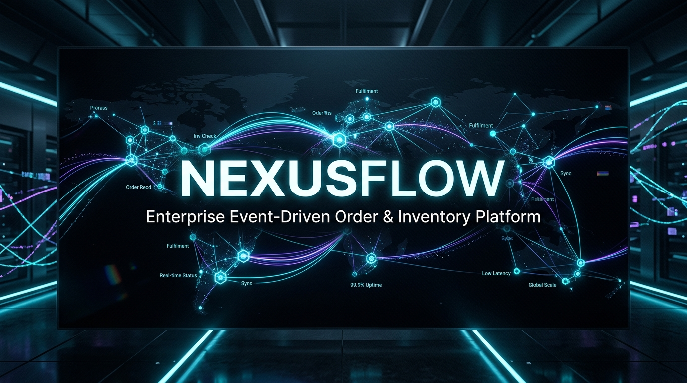
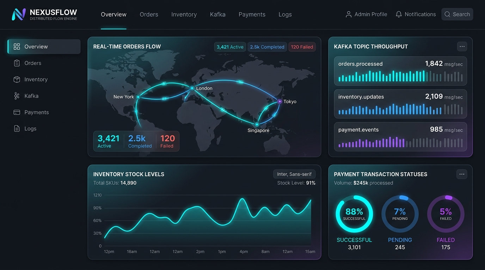
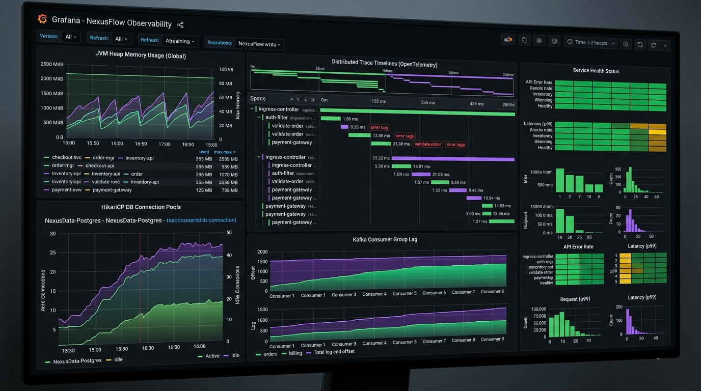
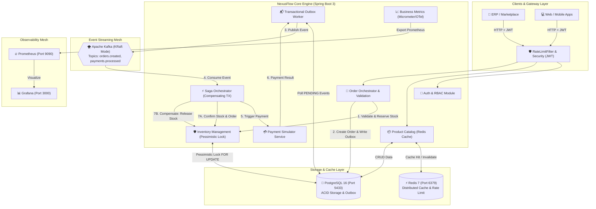
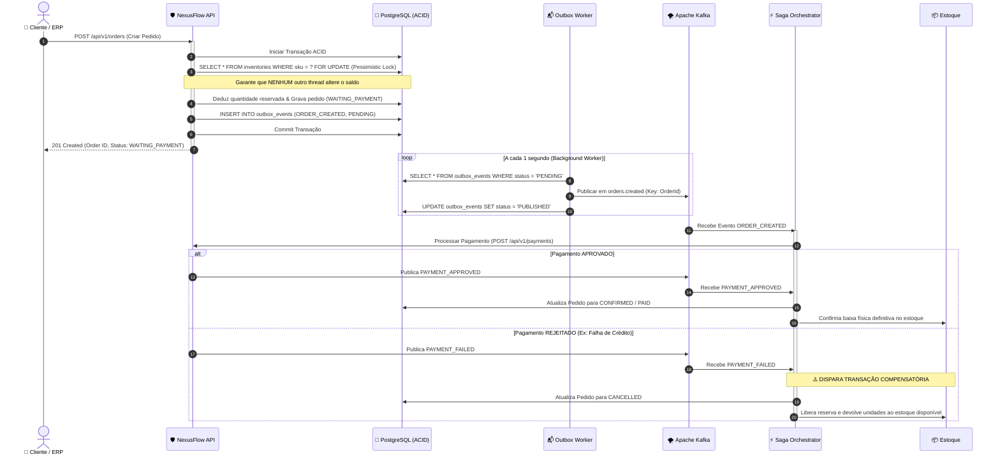
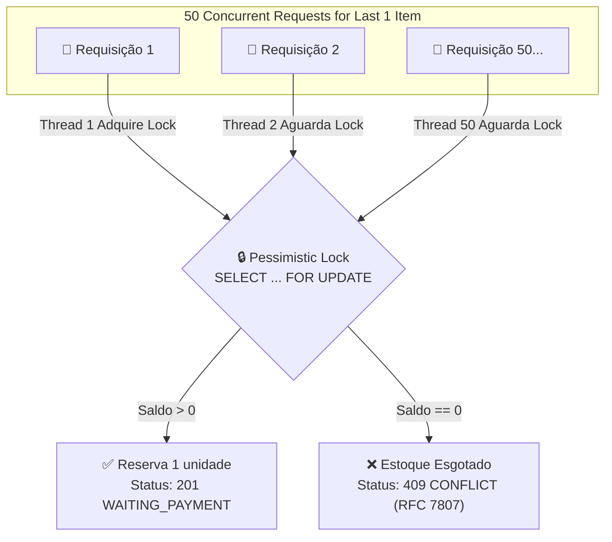

# 🚀 NexusFlow — Enterprise Distributed Order, Inventory & Logistics Platform

<div align="center">



**Plataforma corporativa distribuída para processamento de pedidos em tempo real, controle atômico de estoque, pagamentos assíncronos e orquestração de microsserviços.**

[](https://openjdk.org/)
[](https://spring.io/projects/spring-boot)
[](https://www.postgresql.org/)
[](https://redis.io/)
[](https://kafka.apache.org/)
[](https://kubernetes.io/)
[](https://prometheus.io/)
[](https://grafana.com/)

</div>

---

## 📸 Visão Geral da Interface & Monitoramento

<div align="center">

### 🖥️ Painel Operacional em Tempo Real


### 📊 Observabilidade & Telemetria Distribuída (Prometheus + Grafana + OpenTelemetry)


</div>

---

## 🏛️ Arquitetura do Sistema

O NexusFlow foi concebido segundo os princípios de **Modular Monolith** com preparação para transição a microsserviços, integrando padrões avançados de sistemas distribuídos:



---

## ⚡ Fluxo de Transação Distribuída (Saga Pattern & Outbox)



---

## 🛡️ Controle Atômico de Concorrência (Zero Overselling)



---

## 🚀 Como Executar o Projeto com 1 Único Comando

### 🟢 Iniciar Tudo (Docker + Postgres + Redis + Kafka + Prometheus + Grafana + Spring Boot):
```powershell
.\start.ps1
```
*Ou simplesmente dê dois cliques no arquivo `start.bat`.*
> **Gerenciamento Inteligente de Processos:** O script verifica e encerra automaticamente qualquer processo preso na porta `8085` antes de iniciar, garantindo que o sistema sempre suba na mesma porta oficial sem conflito.

---

### 🛑 Encerrar Tudo com Segurança:
```powershell
.\stop.ps1
```
*Ou simplesmente dê dois cliques no arquivo `stop.bat`.*
> Encerra a aplicação Spring Boot e pausa os containers Docker de forma limpa.

---

## 🌐 Endpoints & Painéis Disponíveis

| Serviço / Endpoint | URL | Credenciais / Notas |
| :--- | :--- | :--- |
| **Swagger UI (OpenAPI 3.0)** | [http://localhost:8085/swagger-ui.html](http://localhost:8085/swagger-ui.html) | Documentação interativa de todos os endpoints |
| **Actuator Health & Metrics** | [http://localhost:8085/actuator/health](http://localhost:8085/actuator/health) | Status do Postgres, Redis, Kafka e Probes |
| **Prometheus Metrics** | [http://localhost:8085/actuator/prometheus](http://localhost:8085/actuator/prometheus) | Métricas técnicas e contadores de negócio |
| **Grafana Dashboard** | [http://localhost:3000](http://localhost:3000) | Usuário: `admin` / Senha: `admin` |
| **pgAdmin 4 (PostgreSQL)** | [http://localhost:5050](http://localhost:5050) | Email: `admin@nexusflow.com` / Senha: `admin` |
| **PostgreSQL 16** | `localhost:5433` | Banco: `nexusflow_db` / User: `nexusflow_user` |
| **Redis 7** | `localhost:6379` | Cache e Rate Limiter |
| **Apache Kafka (KRaft)** | `localhost:9092` | Cluster de Mensageria Distribuída |

---

## 🧪 Testes Automatizados de Produção

### 1. Suíte de Testes Unitários & Concorrência (JUnit 5 + Mockito)
```powershell
.\mvnw.cmd test
```
*Total de **32 testes automatizados** cobrindo concorrência com CountDownLatch, Saga Orchestrator, Outbox, Caching e JWT.*

### 2. Teste E2E de Produção ao Vivo (13 Seções)
Com a aplicação em execução, rode:
```powershell
powershell -NoProfile -ExecutionPolicy Bypass -File .\scripts\test-e2e-production-flow.ps1
```
*Valida todos os 13 cenários de ponta a ponta: Health Check, Login JWT, Cadastro, Cache Redis, Overselling, Saga Aprovada, Saga Rejeitada com Compensação, Rate Limit e Prometheus.*

---

## 🏛️ Architecture Decision Records (ADRs)

Todas as decisões arquiteturais estão formalmente documentadas em [`docs/adr/`](docs/adr/):

- [`ADR-001`](docs/adr/001-modular-monolith-architecture.md): Modular Monolith Architecture
- [`ADR-002`](docs/adr/002-postgresql-and-flyway-for-persistence.md): PostgreSQL & Flyway for Relational Persistence
- [`ADR-003`](docs/adr/003-concurrency-and-locking-strategy.md): Concurrency & Locking Strategy (Pessimistic vs Optimistic)
- [`ADR-004`](docs/adr/004-stateless-authentication-jwt-rbac.md): Stateless Authentication with Spring Security, JWT & RBAC
- [`ADR-005`](docs/adr/005-event-driven-architecture-with-apache-kafka.md): Event-Driven Architecture with Apache Kafka
- [`ADR-006`](docs/adr/006-transactional-outbox-pattern.md): Transactional Outbox Pattern for Reliable Event Publishing
- [`ADR-007`](docs/adr/007-saga-pattern-and-compensating-transactions.md): Saga Pattern & Compensating Transactions
- [`ADR-008`](docs/adr/008-consumer-idempotency.md): Consumer Idempotency for At-Least-Once Delivery
- [`ADR-009`](docs/adr/009-redis-caching-and-distributed-rate-limiting.md): Redis Caching & Distributed Rate Limiting
- [`ADR-010`](docs/adr/010-testcontainers-and-integration-testing-strategy.md): Testcontainers & Integration Testing Strategy
- [`ADR-011`](docs/adr/011-observability-metrics-tracing-with-opentelemetry-prometheus-grafana.md): Observability with OpenTelemetry, Prometheus & Grafana
- [`ADR-012`](docs/adr/012-kubernetes-deployment-and-horizontal-pod-autoscaling.md): Kubernetes Deployment & Horizontal Pod Autoscaling (HPA)

---

## 🗺️ Roadmap de Entregas Realizadas

- [x] **V0.1 — Core Modular Monolith:** Customers, Products, Inventory (Locking), Orders, Flyway, PostgreSQL, OpenAPI & ADRs.
- [x] **V0.2 — Security & RBAC:** Spring Security 6, Stateless JWT, Role-based method security (`ADMIN`, `WAREHOUSE_OPERATOR`, `FINANCE`, `CUSTOMER`), Seeded Administrator.
- [x] **V0.3 — Concurrency & High-Load Testing:** Multithreaded race condition simulation, CountDownLatch test suite, guaranteed zero overselling.
- [x] **V0.4 — Event-Driven Architecture:** Apache Kafka integration (KRaft mode), strongly-typed domain events, partition ordering, and correlation headers.
- [x] **V0.5 — Distributed Resilience:** Transactional Outbox Pattern, Saga Choreography, Compensating Transactions (payment failure triggers stock release), and Idempotent Consumers.
- [x] **V0.6 — Performance & Caching:** Redis 7 2nd-level caching (`@Cacheable`, `@CacheEvict`), Distributed Token Bucket Rate Limiting (HTTP 429 RFC 7807) with fail-open fallback.
- [x] **V0.7 — Testing Excellence & CI/CD:** Testcontainers for PostgreSQL 16, Kafka, Redis; Multi-stage Dockerfile; GitHub Actions automated CI/CD pipeline (`mvn clean verify`).
- [x] **V1.0 — Observability & Cloud Native:** Micrometer Prometheus metrics, OpenTelemetry distributed tracing, Prometheus & Grafana orchestration, and production Kubernetes manifests (`k8s/` Deployment, Service, ConfigMap, Secret, HPA autoscaler).

---

## 👨‍💻 Autor & Filosofia de Engenharia
Desenvolvido por **Osmar Zanardi Machado** como demonstração de engenharia backend sênior em Java & Spring Boot, aplicando Domain-Driven Design, padrões distribuídos resilientes e observabilidade cloud-native.
