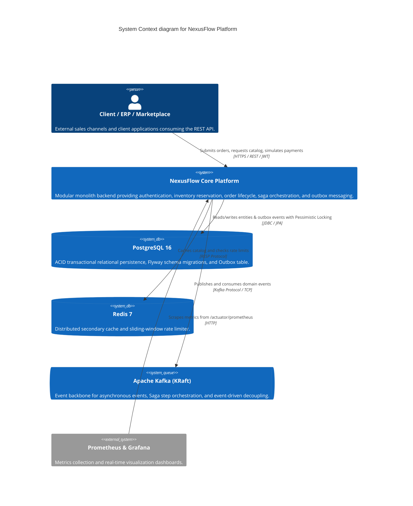
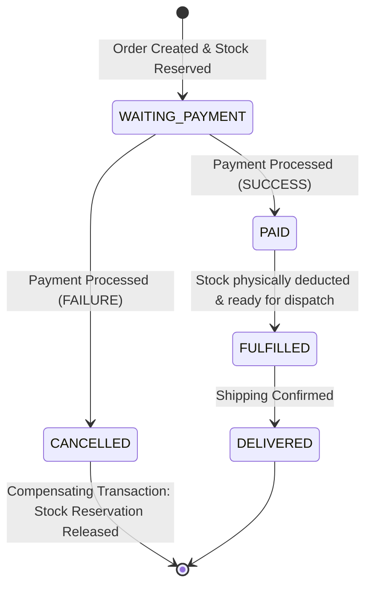

# 🏛️ NexusFlow Architecture Context & Design Document

## 1. System Overview
**NexusFlow** is a distributed enterprise order management, inventory locking, and payment orchestration platform designed for high-concurrency environments.

---

## 2. Module Boundaries & Responsibilities

| Module | Core Responsibility | Key Entities & Components |
| :--- | :--- | :--- |
| **Security & Auth** | Stateless JWT authentication, role management, and endpoint authorization | `User`, `Role`, `JwtService`, `SecurityConfig` |
| **Customer** | Customer profiles, status lifecycle, validation | `Customer`, `CustomerRepository`, `CustomerService` |
| **Product & Catalog** | SKU management, pricing, Redis 2nd-level caching | `Product`, `ProductService`, `@Cacheable` |
| **Inventory** | Stock balances, warehouse allocations, Pessimistic Locking (`SELECT FOR UPDATE`) | `Inventory`, `InventoryReservation`, `InventoryService` |
| **Order Management** | Order creation, validation, pricing calculations, item reservations | `Order`, `OrderItem`, `OrderService` |
| **Payment** | Asynchronous payment gateway simulation, transactional outbox emission | `Payment`, `PaymentService`, `PaymentController` |
| **Saga Orchestrator** | Distributed transaction coordinator, payment approval, compensating transactions | `OrderSagaOrchestrator`, `CompensationWorker` |
| **Transactional Outbox** | Guaranteed at-least-once event publication to Kafka | `OutboxEvent`, `OutboxService`, `OutboxPublisherWorker` |
| **Rate Limiter** | Token bucket / Sliding-window distributed traffic throttling | `RateLimiterService`, `RateLimitFilter` |
| **Observability** | Prometheus business metrics and OpenTelemetry tracing | `BusinessMetricsService`, OpenTelemetry bridge |

---

## 3. Distributed Saga State Machine

